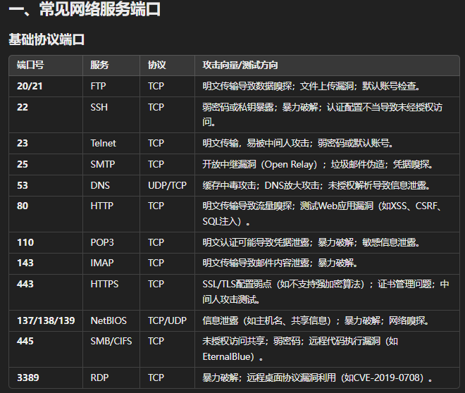
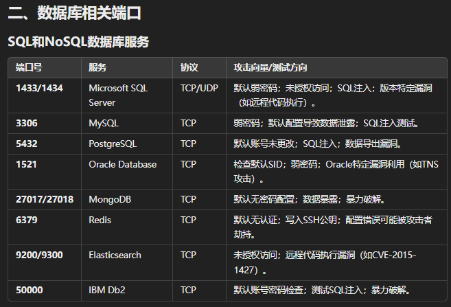
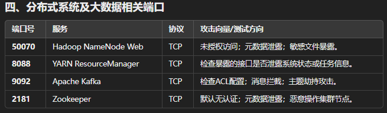
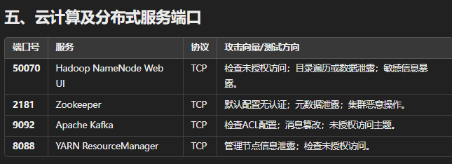
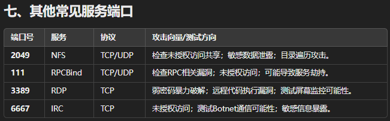

## 主机服务器

### 操作系统

- Web大小写
  - 修改url中参数，改成大写，正常为windows，不正常即为linux
- 端口服务特征
  - 系统特有服务端口
    - linux的22端口
- TTL值判断返回
  - windows一般在100以上
  - linux一般是100以下
- 查看数据包HTTP报头，如果是iis那就肯定是windows

### IP资产

- 归属地查询
- 归属云厂商
- IP反查机构
- IP反查域名
- IP-C段查询

### 端口资产

- 工具
  - nmap
  - masscan
  - fscan
- 扫不到的情况
  - 防火墙（白名单或入站策略）
    - 更换扫描协议，可能有没有禁止的协议，像内网中通过不同协议搭建隧道进行通讯 
    - nmap中支持不同协议的探针
  - 处于内网环境
    - ssrf漏洞扫描端口
    - 反向连接，能反向连接拿shell也没必要扫端口了

### 应用服务

### 角色定性判定

- 网站服务器
- 数据库服务器
- 邮件系统服务器
- 文件存储服务器
- 网络通信服务器
- 安全系统服务器

## Web应用

主动信息收集：

通过直接经过目标服务器**网络流量**的信息收集方式。

被动信息收集：

**不**与目标系统**直接交互**的情况下获取信息收集方式。

### 域名

- 备案信息
  - 通过域名查备案信息，备案信息获取更多域名
- 企业产权
  - 通过企业产权查询Web,APP,小程序等版权资产
- 域名相关性
  - Whois信息：例如域名所有人、域名注册商、邮箱等。
  - 通过域名注册接口获取后缀
  - 查询域名注册邮箱
  - 通过域名查询备案号
  - 通过备案号查询域名
  - 反查注册邮箱
  - 反查注册人
  - 通过注册人查询到的域名在查询邮箱
  - 通过上一步邮箱去查询域名
  - 查询以上获取出的域名的子域名
  - 相似后缀，如.com、.com.cn、.cn

### 子域名

在后续测试中，还要注意对子域名进行筛选整理，太多的垃圾子域名和没用的子域名，主要看你的收集的子域名方法决定。

问以下哪些是主动信息收集，哪些是被动信息收集？

- DNS数据
  - 以DNS解析历史记录查询域名资产
- 证书查询
  - 以SSL证书解析查询域名资产
- 网络空间
  - 多网络空间综合型获取的记录
- 威胁情报
  - 各类接口的集成的记录
- 枚举解析（通过DNS解析域名）
  - 结果主要以字典决定
  - https://github.com/knownsec/ksubdomain
  - https://github.com/shmilylty/OneForAll
- JS提取子域名

前5个是被动信息收集，若通过工具搜索JS产生流量，则第6个是主动信息收集

| **标签** | **名称**     | **地址**                             |
| -------- | ------------ | ------------------------------------ |
| 企业信息 | 天眼查       | https://www.tianyancha.com/          |
| 企业信息 | 小蓝本       | https://www.xiaolanben.com/          |
| 企业信息 | 爱企查       | https://aiqicha.baidu.com/           |
| 企业信息 | 企查查       | https://www.qcc.com/                 |
| 企业信息 | 国外企查     | https://opencorporates.com/          |
| 企业信息 | 启信宝       | https://www.qixin.com/               |
| 备案信息 | 备案信息查询 | http://www.beianx.cn/                |
| 备案信息 | 备案管理系统 | https://beian.miit.gov.cn/           |
| 注册域名 | 域名注册查询 | https://buy.cloud.tencent.com/domain |
| IP反查   | IP反查域名   | https://x.threatbook.cn/             |

 

| **标签** | **名称**               | **地址**                                                     |
| -------- | ---------------------- | ------------------------------------------------------------ |
| DNS数据  | dnsdumpster            | https://dnsdumpster.com/                                     |
| 证书查询 | CertificateSearch      | https://crt.sh/                                              |
| 网络空间 | FOFA                   | https://fofa.info/                                           |
| 网络空间 | 全球鹰                 | http://hunter.qianxin.com/                                   |
| 网络空间 | 360                    | [https://quake.360.cn/quake/](https://quake.360.cn/quake/#/index) |
| 威胁情报 | 微步在线 情报社区      | https://x.threatbook.cn/                                     |
| 威胁情报 | 奇安信 威胁情报中心    | https://ti.qianxin.com/                                      |
| 威胁情报 | 360 威胁情报中心       | https://ti.360.cn/#/homepage                                 |
| 枚举解析 | 在线子域名查询         | http://tools.bugscaner.com/subdomain/                        |
| 枚举解析 | DNSGrep子域名查询      | https://www.dnsgrep.cn/subdomain                             |
| 枚举解析 | 工具强大的子域名收集器 | https://github.com/shmilylty/OneForAll                       |

 

| **标签** | **名称**               | **地址**                                                     |
| -------- | ---------------------- | ------------------------------------------------------------ |
| 网络空间 | 钟馗之眼               | [https://www.zoomeye.org/](https://www.zoomeye.org/?R1nG)    |
| 网络空间 | 零零信安               | https://0.zone/                                              |
| 网络空间 | Shodan                 | https://www.shodan.io/                                       |
| 网络空间 | Censys                 | https://censys.io/                                           |
| 网络空间 | ONYPHE                 | https://www.onyphe.io/                                       |
| 网络空间 | FullHunt               | https://fullhunt.io/                                         |
| 网络空间 | Soall Search Engine    | https://soall.org/                                           |
| 网络空间 | Netlas                 | https://app.netlas.io/responses/                             |
| 网络空间 | Leakix                 | https://leakix.net/                                          |
| 网络空间 | DorkSearch             | https://dorksearch.com/                                      |
| 威胁情报 | VirusTotal在线查杀平台 | https://www.virustotal.com/gui/                              |
| 威胁情报 | VenusEye 威胁情报中心  | https://www.venuseye.com.cn/                                 |
| 威胁情报 | 绿盟科技 威胁情报云    | https://ti.nsfocus.com/                                      |
| 威胁情报 | IBM 情报中心           | https://exchange.xforce.ibmcloud.com/                        |
| 威胁情报 | 天际友盟安全智能平台   | [https://redqueen.tj-un.com](https://redqueen.tj-un.com/IntelHome.html) |
| 威胁情报 | 华为安全中心平台       | [https://isecurity.huawei.com/sec](https://isecurity.huawei.com/sec/web/intelligencePortal.do) |
| 威胁情报 | 安恒威胁情报中心       | https://ti.dbappsecurity.com.cn/                             |
| 威胁情报 | AlienVault             | https://otx.alienvault.com/                                  |
| 威胁情报 | 深信服                 | [https://sec.sangfor.com.cn/](https://sec.sangfor.com.cn/analysis-platform) |
| 威胁情报 | 丁爸情报分析师的工具箱 | http://dingba.top/                                           |
| 威胁情报 | 听风者情报源 start.me  | https://start.me/p/X20Apn                                    |
| 威胁情报 | GreyNoise Visualizer   | https://viz.greynoise.io/                                    |
| 威胁情报 | URLhaus 数据库         | https://urlhaus.abuse.ch/browse/                             |
| 威胁情报 | Pithus                 | https://beta.pithus.org/                                     |

### CDN绕过

#### 子域名查询

可通过流量小的分站去推断可能做了CDN的主站的ip

进入网站自动带www（流量大），所以可能只对带www的网址设置了CDN，故可通过不带www的网址查ip

#### 邮件服务查询

通过对方发送的邮件找ip

#### 国外地址请求

#### 遗留文件

#### 全网扫描

zmap

xmap

**<u>fuckcdn</u>** 

nmap

#### 黑暗引擎搜索特定文件

通过网站不变文件(.iso)的hash搜索

shodan

fofa

zoomeye

#### dns历史记录

第三方查询

#### 以量打量

ddos攻击

**查到ip后可通过修改本地hosts去验证**

## 站点搭建

#### 目录型

网站文件下的不同目录

#### 端口类

不同端口

#### 子域名类

子域名两套cms

接口

#### 类似域名

常用后缀

#### 旁注/c段

同服务器不同站点/同网段不同服务器不同站点

绕过主站通过旁站或漏洞获得权限

#### 软件特征

如phpstudy默认数据库账号与密码为root

## WAF防护

防护产品

## APP提取

漏了个大洞：APK反编译

burp抓包

## 资产监控拓展
