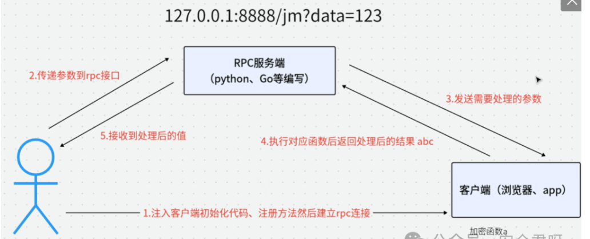

# JS逆向

## AES

对称加密

- ECB
  - key
- CBC
  - key
  - iv

## RSA

非对称加密

- publickey
- secretkey

## HASH

- 不可逆
- md5
- sha

## Jsrpc

直接调用网站本身的加密算法，通过调用接口加密数据



- 首先插入server代码

- 接着有两种劫持加密算法的方式

  - 1.js前端代码中直接插入hook代码，使用本来的加密算法加密传入的参数

    ```js
    var demo = new Hlclient("ws://127.0.0.1:12080/ws?group=encrypt");
    	demo.regAction("encryptest", function (resolve,param) {    
    	resolve(encrypt(param));  //encrypt加密算法
    	})
    ```

  - 2.先将加密算法注册为全局方法，然后直接调用全局方法加密参数

    ```js
    window.encryptest = function(data) { //要劫持的参数，如账号密码json
        return encrypted_password;		 //加密算法
    };
    
    var demo = new Hlclient("ws://127.0.0.1:12080/ws?group=encrypt");
    demo.regAction("encryptest", function (resolve,param) {    
    resolve(window.encryptest(param));
    })
    ```

- 最后访问开启的服务端API

```
http://127.0.0.1:12080/go?group=encrypt&action=encryptest&param=123
```


### encrypt-labs靶场

#### AES加密

- 直接修改js代码

```js
var demo = new Hlclient("ws://127.0.0.1:12080/ws?group=encrypt");
	demo.regAction("encryptest", function (resolve,param) {    
	resolve(CryptoJS.AES.encrypt(param, key, {
			iv: iv,
			mode: CryptoJS.mode.CBC,
			padding: CryptoJS.pad.Pkcs7
		})
		.toString());
	})
```

- 在控制台全局注册

```js
window.encryptest = function(password) {
    return CryptoJS.AES.encrypt(password, key, {
			iv: iv,
			mode: CryptoJS.mode.CBC,
			padding: CryptoJS.pad.Pkcs7
		})
		.toString();
};

var demo = new Hlclient("ws://127.0.0.1:12080/ws?group=encrypt");
demo.regAction("encryptest", function (resolve,param) {    
resolve(window.encryptest(param));
})
```

- 访问API传入参数

```
"{\"username\":\"admin\",\"password\":\"123456\"}"
```


### RSA加密

- 直接加入hook代码

```js
var demo = new Hlclient("ws://127.0.0.1:12080/ws?group=encrypt");
	demo.regAction("encryptest", function (resolve,param) {    
	resolve(encryptor.encrypt(param));
	})

```

- 全局注册

```js
window.encryptest = function(dataString) {
    return encryptor.encrypt(dataString);
};

var demo = new Hlclient("ws://127.0.0.1:12080/ws?group=encrypt");
demo.regAction("encryptest", function (resolve,param) {    
resolve(window.encryptest(param));
})
	
```

### SHA256

```js
var demo = new Hlclient("ws://127.0.0.1:12080/ws?group=encrypt");
	demo.regAction("encryptest", function (resolve,param) {    
	resolve(CryptoJS.HmacSHA256(param, secretKey)
		.toString(CryptoJS.enc.Hex));
	})
```

