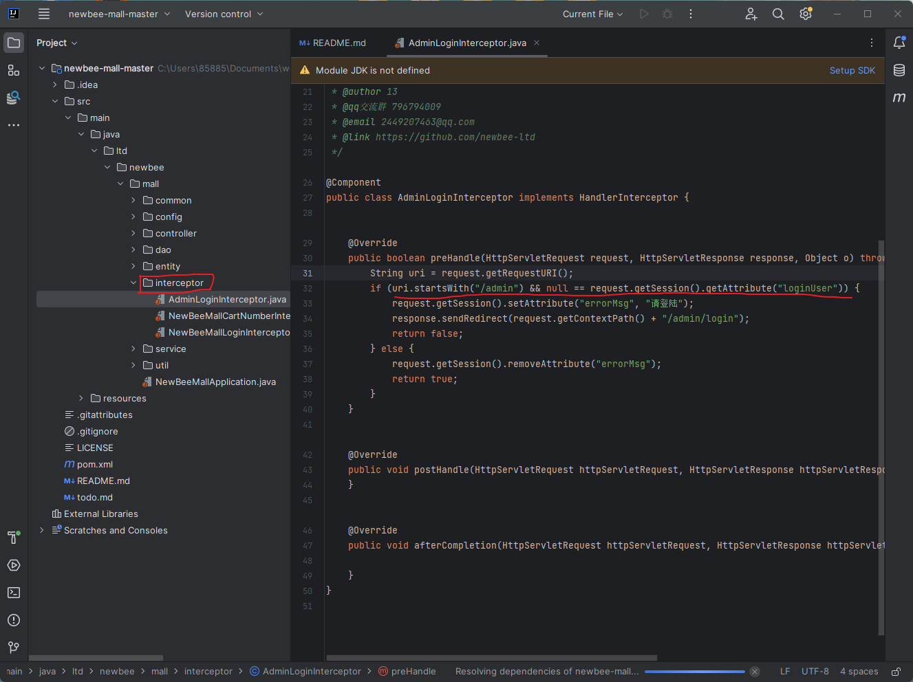
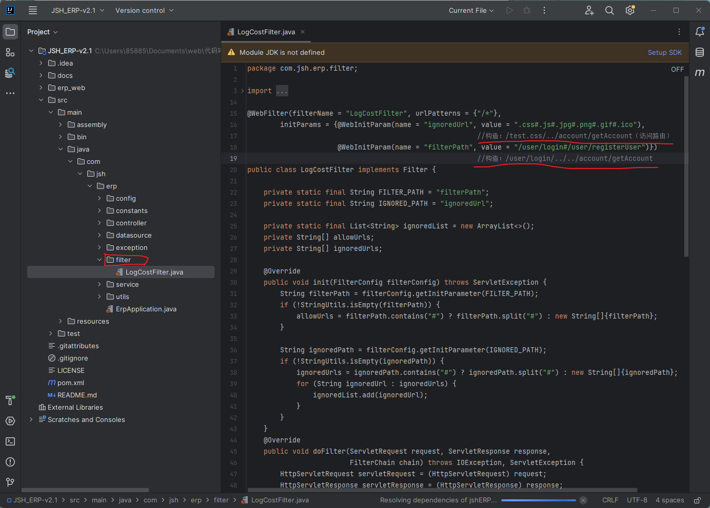
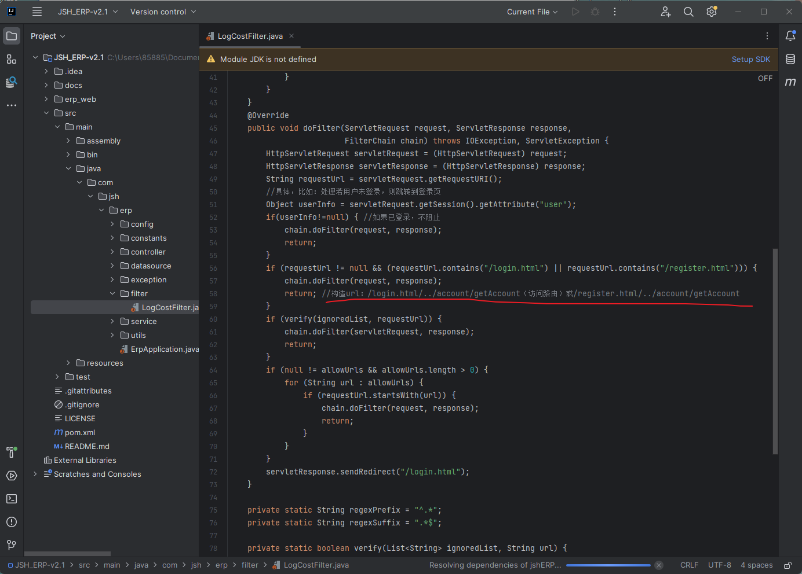
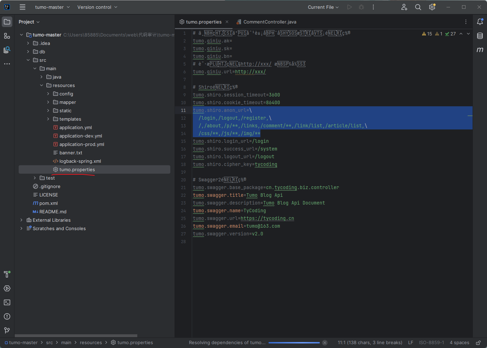
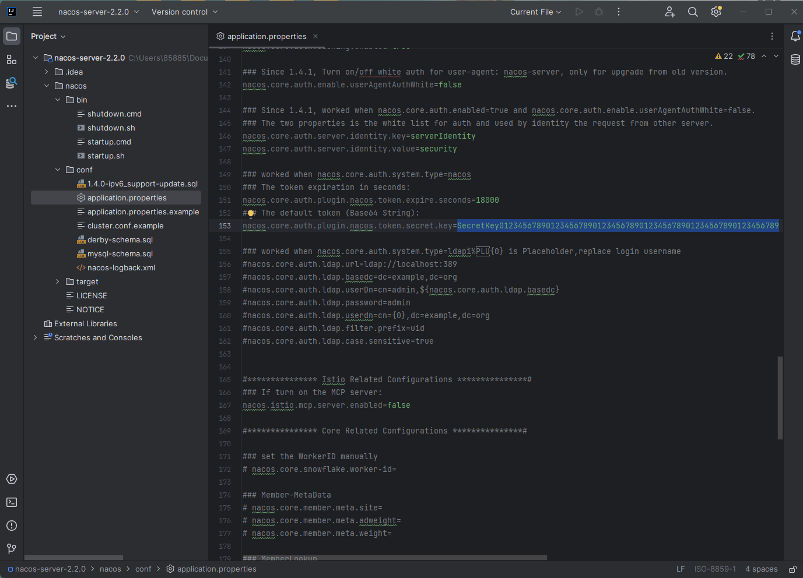

## 漏洞原理

可控**变量**

​				get    post

特定**函数**

​				输出型

​				数据库/命令行操作

## 挖掘思路

### 关键词

#### sql

select、mysql_query

#### 文件操作

move_uploaded_file，copy，upload

正则表达式

​				select、system、exec	

​				echo/print --> xss

### 功能点

根据漏洞特性找对应的功能

### 源码新旧版本比较

一般新版本中会对1day进行修复，通过比较可以找到老版本的漏洞点

### 数据库监控

### 动态调试

### 审计工具

**验证**

1.关键词 -> 漏洞点，通过对参数溯源，再配合网站实际测试找到漏洞。

2.功能点 -> 漏洞点，有burp抓包找对应的目录路由，再对代码溯源分析找到漏洞点

## 特定漏洞

### SQL注入

数据库监控 

### 文件操作

unlink()、file_get_contents()、show_source()、file()、fopen0

### RCE

eval、assert、preg_replace()、call_user_func()、call_user_func_array()

system、exec、shell_exec、``、passthru、pcntl_exec、popen、proc_open

### 变量覆盖

extract()、parse_str()、

## Java

### Filter过滤器

统一处理Web资源后交给Servlet进行后续处理，可实现权限访问控制，过滤敏感词汇，压缩响应信息等。

存在漏洞点，但是需要绕过Filter文件中的过滤

### sql注入

预编译防御

在xml文件配合特定符号中搜索语句

- 基于springboot中，执行SQL三个调用：
  - 1、业务层调用dao层
  - 2、controller层调用Service层间接调用dao层
  - 3、controller层直接调用dao层
  - 利用：找到漏洞点后逐步跟踪函数用法，直到找到调用处（具体路由）

#### JDBC

安全写法：String sql = "select * from user where id = **?**"

使用？占位符对sql语句进行了预编译

不安全写法：String sql = "select * from user where id =" + req.getParameter("id");

使用+号或不安全的拼接

确认是该框架->搜索order by append->跟踪可控参数

#### Mybatis

安全写法：select id,name,age from user where name **#**{name}

不安全写法：select id,name,age from user where name = ${name}

确认是Mybatis框架->搜索${->跟踪方法寻找可控参数

#### Hibernate

安全写法：Query<User>.query=session.createQuery(select * from user where name=:name”); 
query.serParameter("name",parameter); 

不安全写法：Query<User>.query=session.createQuery(select * from user where name=”+req.getParameter("id")); 

可控参数id

#### 总结

造成漏洞的原因：

1.预编译使用不当（使用了拼接）

2.order by/like/in注入（不能预编译）

### 访问控制（越权）

#### 逻辑漏洞

- 看代码的验证逻辑是否有问题
- 自定义代码
- Filter过滤器

#### 版本漏洞

- Shiro框架

  其下anon给出了不需要验证即可操作的内容，通过相关路由即可操作

### 文件操作

#### 文件上传

通过功能点寻找漏洞，如上传头像或上传文件的功能处

过滤器上传：搜new File(

#### 文件下载

搜FileInputStream

#### 文件读取

搜new FileInputStream(

### 身份验证

基本上是代码逻辑漏洞的绕过

#### Intercreptor拦截器

漏洞一般在源码中Intercreptor的preHandler中

- 绕过逻辑
  - 构造url访问路径：///admin或//:/admin

##### Filter过滤器

一般在FIlter的init或doFilter方法中

#### Shiro

anon一般代表shiro身份验证中不需要鉴权的接口，所以可以通过寻找上述路由代码中的利用点，比如CommentContorller.java中：

@RequestMapping("/comment")

@GetMapping("/{id}")

@DeleteMapping("/{id}")

即可通过构造GET /comment/1或DELETE /comment/1访问或删除任意id评论

#### JWT

使用JWT未修改默认密钥，如：SecretKey012345678901234567890123456789012345678901234567890123456789

#### 自写代码

### 第三方组件

在pom文件可找到引用的第三方组件，在网上搜这些组件的漏洞POC，看是否满足漏洞利用的条件

fastjson

log4j

shiro

### SSTI

- freemarker

  - 在admin_index.ftl添加以下代码会带入模板解析

  - <#assign value="freemarker.template.utility.Execute"?

    new()>${value("calc.exe")}

- Thymeleaf

  - 搜索return 可控变量
  - ${T(java.lang.Runtime).getRuntime().exec("calc.exe")}

### 框架RCE

确定有无漏洞

确定有无回显

可通过DNS带外判断

#### 调用命令函数

#### 表达式注入

jstl

ognl

spel

#### 模板注入

#### XXE

**poi**-ooxml

#### 第三方组件

### 反序列化

#### 调用

Objectinputstream

XMLDecoder

Yaml

Xstream

ObjectMapper

JSON

#### 利用

思路：找反序列化操作、看过滤情况以及是否有可利用库，然后构造利用链

库包调用反射（调用原生类）：ysoserial

**框架**（针对特定框架）组件特性：Fastjason、shiro、jackson、

commons cellections

#### 工具

JNDI

ysoserial

marshalsec

Fastjasonexploit

#### Fastjson反序列化

反序列化时调用自定义方法（对象的get和set方法）

#### shiro反序列化

调用JAVA原生反序列化方法

URLDNS链

CC链

#### 原生反序列化

CC链

### 内存马

#### Listener

#### Filter

#### Servlet

引入Servlet类

给出调用路由

不同的请求方式调用不同的方法（doGet等）

## 语言框架

封装了很多函数方法，直接通过引用写法来实现功能

### ThinkPHP

用官方给定写法，可以调用官方封装的过滤器进行注入等一系列的漏洞

挖掘基于tp开发的cms的漏洞：

1.先看cms是否是基于框架的写法，如果不是则常规绕过

2.如果是则搜索tp版本，直接在网上找对应版本的漏洞利用

3.若网上没有相应的版本利用就只能自己挖掘框架漏洞

### Springboot

### Flask

## 代码架构

对代码审计的影响：url地址对应的文件目录与常规源码不同，并且其中类的函数的触发方法也不同。

### 常规

函数调用：并不能直接通过url触发，而是要在源码中被调用来触发

### MVC

文件目录与路由对应

函数调用：m参数为对应类，a参数为其下函数

将业务逻辑、数据与界面分离来组织代码

## 技巧

### 随机挖掘

### 定点挖掘

功能点

### 批量挖掘

#### SAST

静态代码审计（工具自动源码审计）

#### IAST

交换式代码审计

搭建号源码后部署在相应平台，通过在网站进行操作自动在平台生成漏洞检测报告

